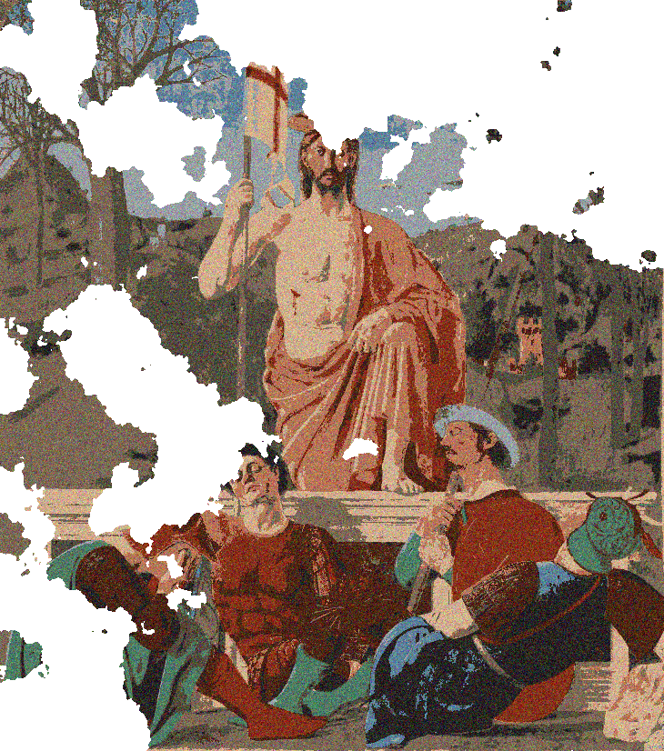
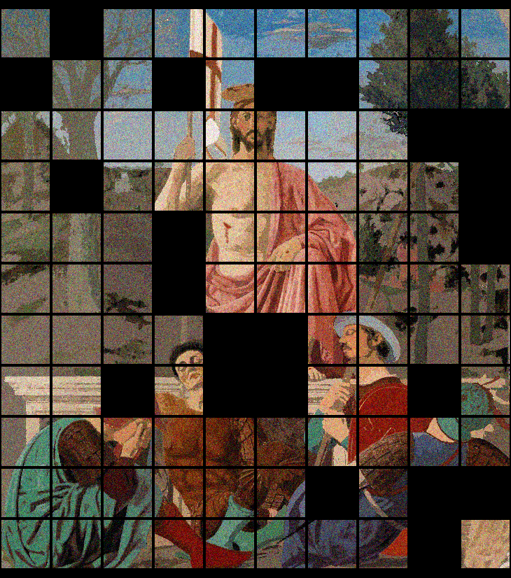

Presentation
------------
This directory contains tools for automatically generating simulated frescoes and provide them in the appropriate format with ground truths. More precisely, it 
takes the fresco models from [1] as input and generates new data by simulating fragmentations but also degradations on both fresco models (noise, missing parts, 
color fading) and fragment images (noise, erosion and color fading). Degradations are simulated exactly in the same way as in the directory **irregular_dafne2**. 
The generated fragments are **rectangular**. Hence, locations are constrained to lie on a regular lattice. Whatever the location on the latter, the rotation 
angles are constrained to be among {-270,-180,-90,0}. An example of illustration is given below for the fresco ``Resurrection'' painted by Piero Della Francesca.

References
----------
[1] DAFNE: A dataset of fresco fragments for digital anastlylosis. P. Dondi, L. Lombardi, A. Setti, Pattern Recognition Letters, volume 138, pages 631-637, 2020.
